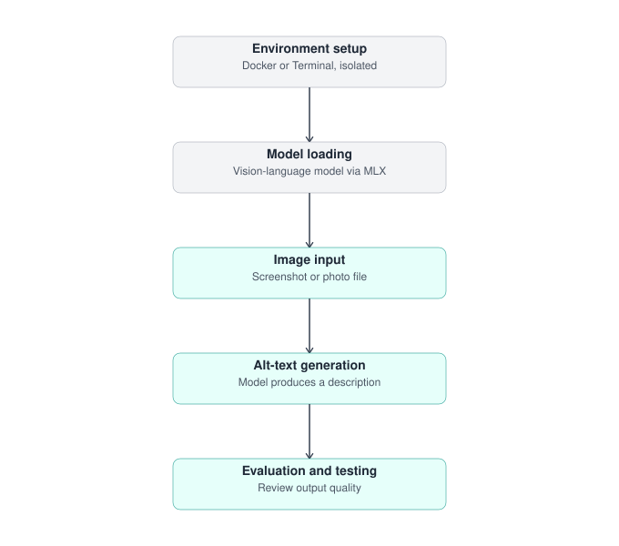
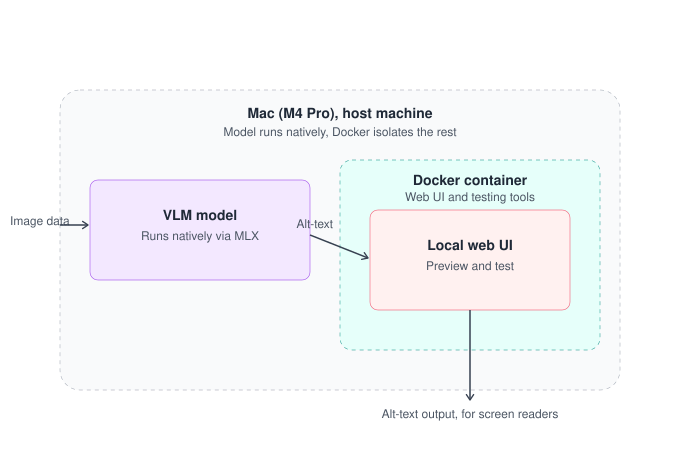

# Alt-Text Generator

A locally-run tool that generates alt-text descriptions for images, using a vision-language model running natively on Apple Silicon (via MLX), with a browser-based upload interface isolated in Docker.

Built as a personal learning project — the goal is both a working accessibility tool and a hands-on understanding of every layer involved (Flask, Docker/Colima, and local vision-language model inference).

## Pipeline

The one-time setup phase (environment + model loading) happens once; the runtime loop (image in, alt-text out, then evaluation) repeats for every image.

## Architecture

This is intentionally a working sketch, not a finalized diagram — it will be revised as the project evolves. Key design decision: the vision-language model runs **natively** on macOS (not inside Docker), since Linux VMs on Apple Silicon currently have no GPU/Metal passthrough — containerizing the model would force CPU-only inference and lose the point of using MLX. Docker is used instead to isolate the web UI and testing tools, which don't need GPU access.

## Status

- [x] Environment setup — Homebrew, Colima, Docker
- [x] Model loading — `Qwen2-VL-7B-Instruct-4bit` via MLX, running natively
- [x] Image preprocessing — automatic resize + baseline JPEG conversion (fixes silent failures on large/progressive JPEGs)
- [x] Web UI — Flask app, containerized, hand-built (not a framework like Gradio) for learning purposes
- [ ] Connecting the containerized web UI to the native model server
- [ ] Ongoing evaluation — accuracy testing across varied image types

## Known limitations

- Vision-language models, especially smaller/quantized ones, can produce confidently incorrect descriptions. Outputs should be reviewed before being relied on for accessibility purposes — this is an active area of testing in this project, not a solved problem.
- Large (multi-megapixel) or progressively-encoded JPEGs require preprocessing before reaching the model; this is now handled automatically, but is a good example of a failure mode that looked like a bug before it was understood.
- The included Flask development server is not intended for production use.

## AI assistance & attribution

This project was built with AI assistance (Claude, Anthropic) for drafting code, debugging, explaining concepts, and writing documentation. All architecture decisions, testing, and final review were done by the author. AI-generated content has been reviewed for accuracy before being committed.

See [`PERSONAL_AI_POLICY.md`](PERSONAL_AI_POLICY.md) for the full policy governing how AI tools were used throughout this project, including data-handling boundaries, review standards, and disclosure practices.
